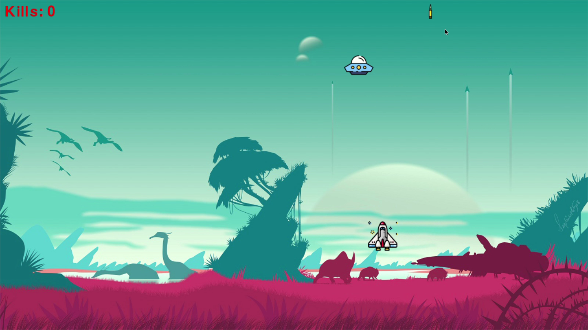

# Shooting-Game-With-Python
```
Angshuman Bora
angshuman.bora.official@gmail.com
```



### To load the game, go to terminal and type
> python run.py

### REQUIRED MODULE 
- [x] pygame
- [x] numpy

### CONTROLS
- key up -> UP
- key down -> DOWN
- key left -> LEFT
- key right -> RIGHT
- SPACE key -> SHOOT MISSILE
